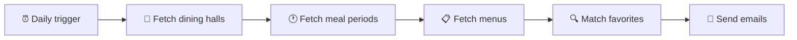

# 🍽️ Mealert

**Never miss your favorite dining hall meal.**

Mealert checks campus dining menus every morning, matches menu items
against each user's saved favorites, and sends a personalized email
with what's being served, where, and how many calories it has.

## ⚙️ How it works

1. **Fetch locations:** get the list of dining halls and their IDs
2. **Fetch meal periods:** for each hall, request the day's periods
   (Breakfast, Lunch, Dinner, Everyday) and their period IDs
3. **Fetch menus:** for each hall and period, request the full menu
4. **Parse:** walk the nested JSON (period → categories → items) and
   extract each item's name, station, portion, and calories
5. **Match:** compare menu items against each user's favorites, stored
   as a set for O(1) lookups
6. **Notify:** email each user a summary of their matches (users with
   no matches get no email)

## 📡 Data source

Menu data comes from the Dine on Campus platform, which serves JSON
through a REST API. The endpoints were identified by inspecting the
dining site's network requests:

| Endpoint | Purpose |
| --- |