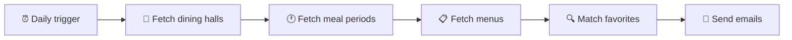

# 🍽️ Mealert

**Never miss your favorite dining hall meal.**

Mealert checks campus dining menus every morning, matches menu items
against each user's saved favorites, and sends a personalized email
with what's being served, where, and how many calories it has.

## ⚙️ How it works

1. **Fetch locations:** get the list of dining halls and their IDs
2. **Fetch meal periods:** for each hall, request the day's periods
   (Breakfast, Lunch, Dinner, Everyday) and their period IDs
3. **Fetch menus:** for each hall and period, request the full menu
4. **Parse:** walk the nested JSON (period → categories → items) and
   extract each item's name, station, portion, and calories
5. **Match:** compare menu items against each user's favorites, stored
   as a set for O(1) lookups
6. **Notify:** email each user a summary of their matches (users with
   no matches get no email)

## 📡 Data source

Menu data comes from the Dine on Campus platform, which serves JSON
through a REST API. The endpoints were identified by inspecting the
dining site's network requests:

| Endpoint | Purpose |
| --- | --- |
| `GET /locations/{locationId}/periods/?date=YYYY-MM-DD` | Meal periods and their IDs for a given day |
| `GET /locations/{locationId}/menu?date=YYYY-MM-DD&period={periodId}` | Full menu for one meal |

Each menu item includes its name, description, portion size, calories,
a full nutrient breakdown, and dietary tags (Vegan, Vegetarian,
Avoiding Gluten, and allergens).

Period IDs are not hardcoded, since they may change. They are fetched
fresh on each run.

## 🛠️ Tech stack

- 🐍 **Python**: core logic
- 🌐 **requests**: HTTP calls to the menu API
- 🗄️ *Planned:* SQLite for users, favorites, and menu history
- ⏰ *Planned:* GitHub Actions for daily scheduled runs
- 📧 *Planned:* email delivery service for notifications

## 🗺️ Roadmap

- [ ] Fetch and print one day's menu for one dining hall
- [ ] Support all dining halls
- [ ] Match menu items against a hardcoded favorites list
- [ ] Send email notifications
- [ ] Run automatically every morning
- [ ] Save daily menus to build a menu history
- [ ] Sign-up form for users to choose favorites
- [ ] Dietary filters (vegetarian, gluten-free, allergens)
- [ ] Support other schools that use Dine on Campus

## 📝 Design notes

- **Polite by design:** a few requests once per day, no constant polling
- **School-agnostic:** school and location IDs live in one config spot,
  so other Dine on Campus schools can be added later
- **Secrets stay local:** credentials live in a `.env` file that is
  never committed

## ⚠️ Disclaimer

Mealert is an independent student project. It is not affiliated with
or endorsed by Colgate University, Colgate Dining Services, or
Dine on Campus.